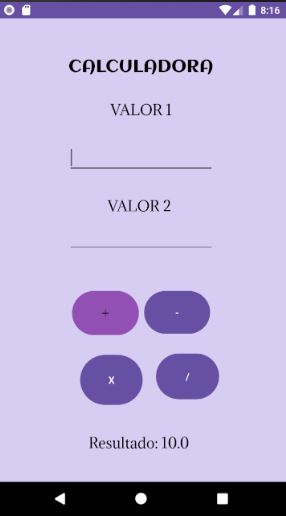

# AtividadeApp1

## SOBRE O PROJETO:

O projeto tem como propósito intensificar a aprendizagem de java, foi feito uma cálculadora simples onde possui as operações básicas:Somar, Subtrair, Dividir e Multiplicar;

##  TELA DO PROJETO

  

